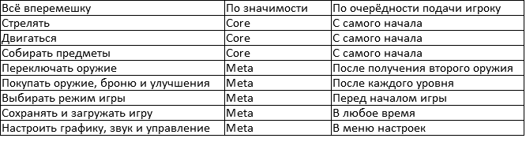

# Введение в разработку игр

## Урок 3. Основы геймдизайна

**Alien Shooter** - это изометрическая игра в жанре действия и стрельбы, где вы играете за солдата, сражающегося с кровожадными пришельцами! Ваша задача - проникнуть в секретную военную лабораторию и уничтожить всех инопланетных захватчиков, которые угрожают человечеству. Вы можете выбирать различные виды оружия, брони и улучшений, чтобы повысить свои шансы на выживание. Игра имеет несколько режимов игры, включая кампанию и  выживание.

Вот список всех возможных действий в игре, расположенных в таблице по разным критериям:

**Cхема общего игрового цикла в игре Alien Shooter:**

A[Выбор режима игры] --> B[Начало игры]

B --> C[Движение и стрельба]

C --> D{Собирание предметов}

D -->|Да| E[Получение оружия, брони или улучшения]

E --> C

D -->|Нет| F{Конец уровня или смерть}

F -->|Конец уровня| G[Покупка оружия, брони и улучшений]

G --> B

F -->|Смерть| H[Загрузка сохранённой игры или начало 
заново]

H --> B

>Начинать читать цикл нужно с блока “Выбор режима игры”. Каждый блок описывает действие, которое выполняет игрок или игра, а стрелки показывают, куда переходит игровой процесс после этого действия. На схеме есть два условных блока, которые зависят от того, что происходит в игре: “Собирание предметов” и “Конец уровня или смерть”. Они определяют, какие дополнительные действия доступны игроку или какая ситуация наступает в игре. Схема упрощает понимание игрового цикла, показывая его основные элементы и связи между ними.